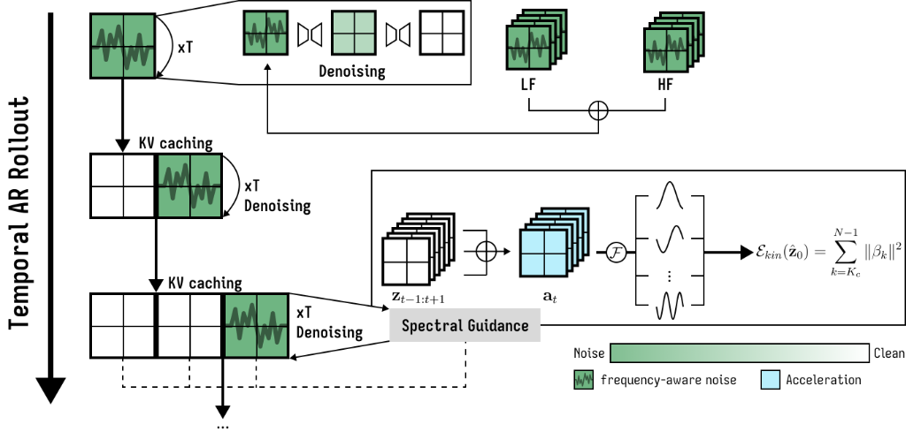

<h1 align="center">SAGA: Stable Acceleration Guidance for Autoregressive Video Generation</h1>

<p align="center">
  <b>Thanh-Nhan Vo</b><sup>1,2</sup>, 
  <b>Trong-Thuan Nguyen</b><sup>1,2</sup>, 
  <b>Trung-Hoang Le</b><sup>1,2</sup>, 
  <b>Tam V. Nguyen</b><sup>3</sup>, and 
  <b>Minh-Triet Tran</b><sup>1,2</sup>
</p>

<p align="center">
  <sup>1</sup> <i>University of Science, VNU-HCM, Vietnam</i><br>
  <sup>2</sup> <i>Vietnam National University, Ho Chi Minh City, Vietnam</i><br>
  <sup>3</sup> <i>University of Dayton, Ohio, U.S.A.</i><br>
  <code>{vtnhan, ntthuan}@selab.hcmus.edu.vn, lthoang@fit.hcmus.edu.vn, tnguyen1@udayton.edu, tmtriet@fit.hcmus.edu.vn</code>
</p>

<p align="center">
  <a href="LICENSE"></a>
  <a href="https://pytorch.org/"></a>
  <a href="https://arxiv.org/abs/2607.08020"></a>
</p>

---

This repository contains the official PyTorch implementation of **SAGA** (Stable Acceleration Guidance for Autoregressive Video Generation). SAGA is a training-free inference-time stabilization framework designed to eliminate temporal inconsistencies—such as flickering, motion jitter, and structural drift—commonly found in autoregressive video diffusion rollouts.

## 🔥 News
* **Accepted at ACCV 2026**: SAGA has been accepted for presentation at ACCV 2026.
* **2026.07.18**: Our paper is available on [arXiv](https://arxiv.org/abs/2607.08020).
* **2026.07.09**: The official code of SAGA is released!

---

## 🔬 Method Overview

Autoregressive video diffusion models are highly efficient for streaming and long-horizon generation, but repeatedly reusing generated latents as causal context accumulates small temporal errors over time. By analyzing these instabilities from a spectral kinematic perspective, SAGA introduces a training-free, dual-action mechanism to stabilize temporal dynamics:
* **Structured Autoregressive Noise Initialization (SAN)**: A kinematically neutral noise prior that decorrelates adjacent noise frames while preserving longer-range dependencies.
* **Acceleration-Domain Spectral Guidance (SG)**: An inference-time guidance objective based on finite-window Slepian projections (Discrete Prolate Spheroidal Sequences - DPSS) that isolates and suppresses unstable high-frequency kinematic energy during denoising.

<p align="center">
  
</p>

---

## 📊 Quantitative Results on VBench

SAGA consistently boosts temporal consistency metrics across state-of-the-art 1.3B-parameter Wan2.1 autoregressive diffusion backbones:

<table>
  <thead>
    <tr>
      <th>Model</th>
      <th align="center">SC</th>
      <th align="center">BC</th>
      <th align="center">TF</th>
      <th align="center">MS</th>
      <th align="center">TQ</th>
      <th align="center">AQ</th>
      <th align="center">IQ</th>
    </tr>
  </thead>
  <tbody>
    <tr>
      <td colspan="8"><b><i>Autoregressive-Diffusion Hybrid Models</i></b></td>
    </tr>
    <tr>
      <td>CausVid [26] (CVPR 2025)</td>
      <td align="center">95.91</td>
      <td align="center">96.46</td>
      <td align="center"><u>99.02</u></td>
      <td align="center">97.81</td>
      <td align="center">97.30</td>
      <td align="center">64.18</td>
      <td align="center">67.23</td>
    </tr>
    <tr>
      <td>Self-Forcing [10] (NeurIPS 2025)</td>
      <td align="center">95.60</td>
      <td align="center">96.20</td>
      <td align="center">99.00</td>
      <td align="center">98.38</td>
      <td align="center">97.30</td>
      <td align="center">66.33</td>
      <td align="center">69.60</td>
    </tr>
    <tr>
      <td>Causal-Forcing [28] (ICML 2026)</td>
      <td align="center">95.43</td>
      <td align="center">96.15</td>
      <td align="center">97.97</td>
      <td align="center">97.52</td>
      <td align="center">96.77</td>
      <td align="center">66.82</td>
      <td align="center">70.11</td>
    </tr>
    <tr>
      <td colspan="8"><b><i>Our approaches</i></b></td>
    </tr>
    <tr>
      <td><b>CausVid + SAGA</b></td>
      <td align="center"><b>96.71</b></td>
      <td align="center">96.59</td>
      <td align="center">98.96</td>
      <td align="center">98.04</td>
      <td align="center">97.58</td>
      <td align="center">64.39</td>
      <td align="center">67.46</td>
    </tr>
    <tr>
      <td><b>Self-Forcing + SAGA</b></td>
      <td align="center"><u>96.63</u></td>
      <td align="center"><b>96.95</b></td>
      <td align="center"><b>99.19</b></td>
      <td align="center"><b>98.85</b></td>
      <td align="center"><b>97.91</b></td>
      <td align="center"><b>66.48</b></td>
      <td align="center"><u>70.51</u></td>
    </tr>
    <tr>
      <td><b>Causal-Forcing + SAGA</b></td>
      <td align="center">96.13</td>
      <td align="center">96.57</td>
      <td align="center">98.63</td>
      <td align="center">97.97</td>
      <td align="center">97.33</td>
      <td align="center">66.66</td>
      <td align="center">69.83</td>
    </tr>
  </tbody>
</table>

*Note: SC, BC, TF, MS, TQ, AQ, and IQ correspond to Subject Consistency, Background Consistency, Temporal Flickering, Motion Smoothness, Temporal Quality, Aesthetic Quality, and Image Quality, respectively. Best results are shown in **bold**, and second-best results are <u>underlined</u>.*


---

## 📄 Paper and Roadmap

The SAGA paper was accepted at ACCV 2026 and is available on [arXiv:2607.08020](https://arxiv.org/abs/2607.08020).

Planned extensions:
- Build a web demo (Gradio or Replicate)
- Add ComfyUI integration
- Support additional autoregressive video diffusion backbones


---

## 📁 Repository Layout

The SAGA core method is centralized under the `saga/` package, with backbones vendored as target inference sites:

```text
SAGA/
├── backbones/           # Target inference backbones
│   ├── self_forcing/    # Self-Forcing wrapper & entry points
│   ├── causal_forcing/  # Causal-Forcing wrapper & entry points
│   └── causvid/         # CausVid wrapper & entry points
├── saga/                # SAGA core method package
│   ├── __init__.py
│   ├── noise.py         # SAN (Dual-AR) noise generators
│   └── guidance.py      # Slepian/FFT kinematic guidance module
├── scripts/             # Shell scripts for executing evaluations
├── docs/                # Documentation and architecture notes
└── README.md
```

* **[saga/noise.py](saga/noise.py)**: Contains the implementation of the Dual-AR noise generator (`generate_dual_ar_noise`).
* **[saga/guidance.py](saga/guidance.py)**: Contains the `SAGAGuidance` module which computes the high-frequency temporal acceleration Slepian/FFT loss and guides the predicted clean latent.

---

## ⚙️ Configuration & Run Instructions

### Environment Variables

Before running the evaluation scripts, you can customize execution via the following environment variables:

* `CUDA_VISIBLE_DEVICES`: Target GPU device list (default: `0`).
* `CHECKPOINT_PATH` / `CHECKPOINT_FOLDER`: Path to model checkpoint file or folder containing weights. (Defaults are set internally to point inside each backbone folder).
* `PROMPT_PATH`: Path to the evaluation prompt `.txt` file.
* `OUTPUT_ROOT`: Parent directory for saving generated videos (default: `./outputs`).
* `SEED`: Random seed (defaults: `0` for Self-Forcing/Causal-Forcing, `42` for CausVid).

### Running Evaluations

We provide wrapper scripts to run either the baseline (`*_raw.sh`) or the SAGA-guided (`*_method.sh`) variant. 

> [!IMPORTANT]
> If you specify relative paths for `CHECKPOINT_PATH`, `CHECKPOINT_FOLDER`, or `PROMPT_PATH`, prefix them with `$(pwd)/` to ensure they resolve correctly when the script changes directories to the backbone folders.

#### 1. Self-Forcing
```bash
# SAGA-Stabilized Run
CHECKPOINT_PATH=$(pwd)/backbones/self_forcing/checkpoints/self_forcing_dmd.pt \
PROMPT_PATH=$(pwd)/backbones/self_forcing/prompts/MovieGenVideoBench_extended.txt \
bash scripts/run_self_forcing_method.sh

# Baseline Run
CHECKPOINT_PATH=$(pwd)/backbones/self_forcing/checkpoints/self_forcing_dmd.pt \
PROMPT_PATH=$(pwd)/backbones/self_forcing/prompts/MovieGenVideoBench_extended.txt \
bash scripts/run_self_forcing_raw.sh
```

#### 2. Causal-Forcing
```bash
# SAGA-Stabilized Run
CHECKPOINT_PATH=$(pwd)/backbones/causal_forcing/checkpoints/chunkwise/causal_forcing.pt \
PROMPT_PATH=$(pwd)/backbones/causal_forcing/prompts/example_prompts.txt \
bash scripts/run_causal_forcing_method.sh

# Baseline Run
CHECKPOINT_PATH=$(pwd)/backbones/causal_forcing/checkpoints/chunkwise/causal_forcing.pt \
PROMPT_PATH=$(pwd)/backbones/causal_forcing/prompts/example_prompts.txt \
bash scripts/run_causal_forcing_raw.sh
```

#### 3. CausVid
```bash
# SAGA-Stabilized Run
CHECKPOINT_FOLDER=$(pwd)/backbones/causvid/wan_models \
PROMPT_PATH=$(pwd)/backbones/causvid/sample_dataset/MovieGenVideoBench.txt \
bash scripts/run_causvid_method.sh

# Baseline Run
CHECKPOINT_FOLDER=$(pwd)/backbones/causvid/wan_models \
PROMPT_PATH=$(pwd)/backbones/causvid/sample_dataset/MovieGenVideoBench.txt \
bash scripts/run_causvid_raw.sh
```

---

## ✏️ Citation

If you find SAGA useful in your research, please cite our paper:

```bibtex
@article{vo2026saga,
  title={SAGA: Stable Acceleration Guidance for Autoregressive Video Generation},
  author={Vo, Thanh-Nhan and Nguyen, Trong-Thuan and Le, Trung-Hoang and Nguyen, Tam V. and Tran, Minh-Triet},
  journal={arXiv preprint arXiv:2607.08020},
  year={2026}
}
```

---

## 🙏 Acknowledgements

This codebase is built upon and integrates components from the open-source implementations of [Self-Forcing](https://github.com/guandeh17/Self-Forcing), [Causal-Forcing](https://github.com/thu-ml/Causal-Forcing), and [CausVid](https://github.com/tianweiy/CausVid). We sincerely thank the authors of these projects for releasing their code and contributing to the video generation research community.
